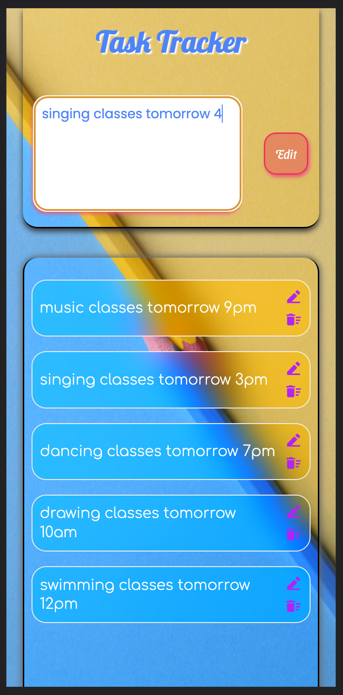

# task-tracker-react-express-mysql-web-app

react functional web app with express mysql sequelize rest api.
  

### Step 1: Download Zip OR clone this repository.

### Step 2: Open terminal, go to this project directory.

### Step 3: Open `frontend` folder and Type `npm install` AND `npm start`.

### Step 4: Open `backend` folder and Type `npm install` AND `npm start`.

> The web app should launch on `http://localhost:3000/`.

>    

